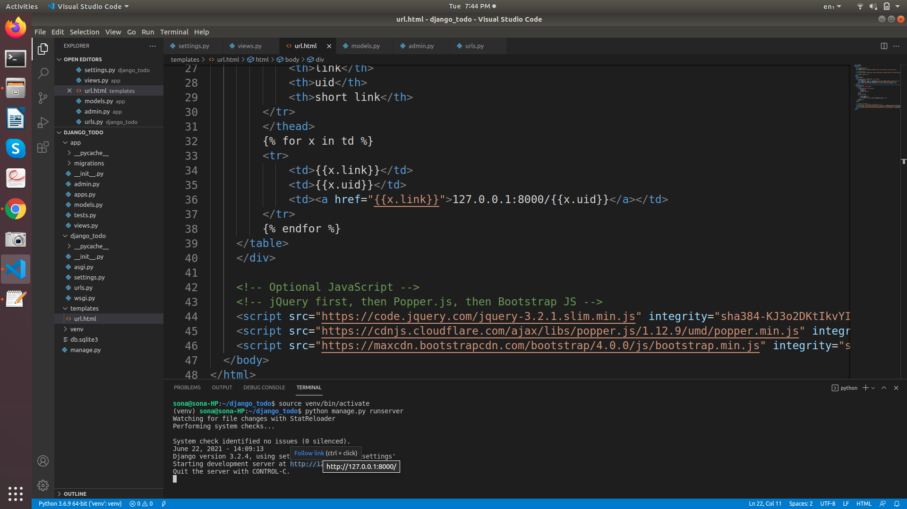
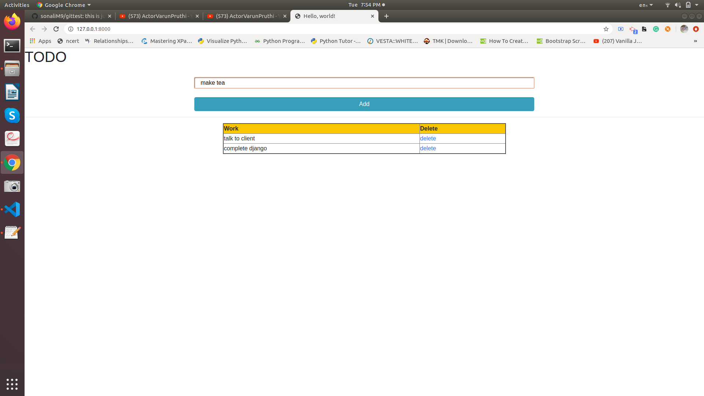
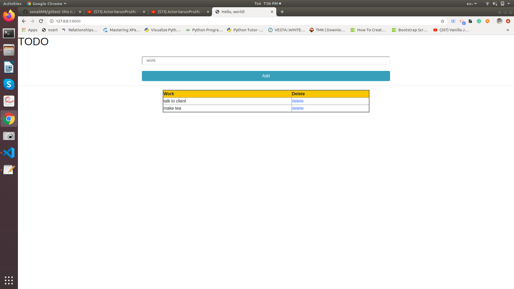

# todo_list

todo_1 project(TODO PROJECT)      
====================================================
Steps to execute :-

Open the project in VS CODE

Inorder to activate virtual environment ,write the below code in terminal:-
    source venv/bin/activate

To runserver write command in VS CODE terminal:-
    python manage.py runserver
    

Then follow link http://127.0.0.8000/

Then write the work you will do , The work will be added in the table .

If you want to delete the completed work simply click on the Delete link . The work will be deleted.

